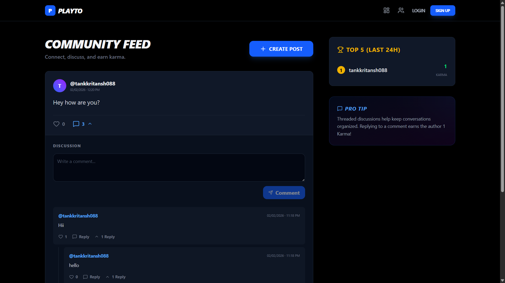

# Community Feed Prototype

A high-performance community feed with threaded comments and a dynamic 24-hour leaderboard.

## Tech Stack
- **Backend:** Django 5.2 & Django REST Framework
- **Frontend:** Next.js (React) & Tailwind CSS
- **Database:** PostgreSQL (Supabase)
- **Auth:** Supabase Auth
- **Icons:** Lucide React

## Key Features
- **Efficient Threaded Comments:** Fetching 50+ nested comments in a single SQL query (O(1) query complexity).
- **Dynamic Leaderboard:** Real-time Karma calculation based on the last 24 hours of activity.
- **Race Condition Protection:** Database-level unique constraints to prevent "double liking" and karma inflation.
- **Responsive UI:** Dark-themed, high-fidelity React interface.

## Getting Started

### Prerequisites
- Python 3.11+
- Node.js / Bun

### 1. Setup Backend
```bash
cd backend
pip install -r requirements.txt # or install django djangorestframework django-cors-headers
python manage.py migrate
python seed.py # Populate with dummy data
python manage.py runserver
```

### 2. Setup Frontend
```bash
# In the root directory
bun install
bun run dev
```

The app will be available at `http://localhost:3000`.

## Architecture Highlights
- **N+1 Avoidance:** Comment trees are built in-memory after a single flat fetch.
- **Dynamic Aggregation:** Karma is calculated on-the-fly using correlated subqueries for maximum data integrity.
- **Atomic Likes:** `get_or_create` combined with `UniqueConstraint` ensures concurrency safety.

## User Interface


## License

MIT License - See LICENSE file for details
